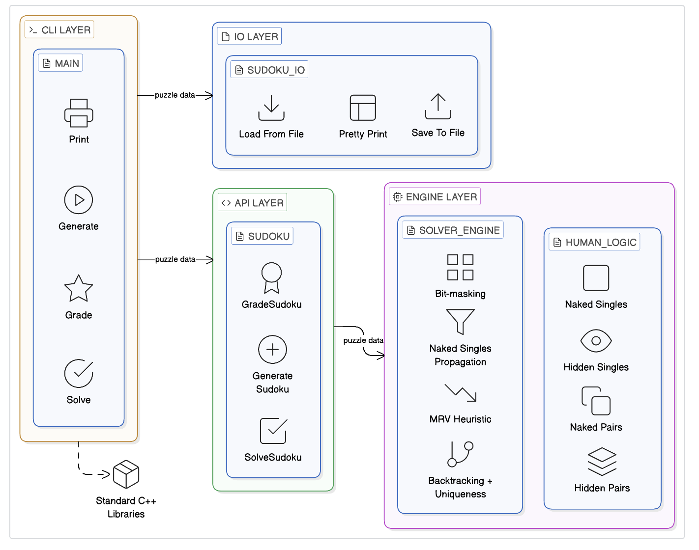
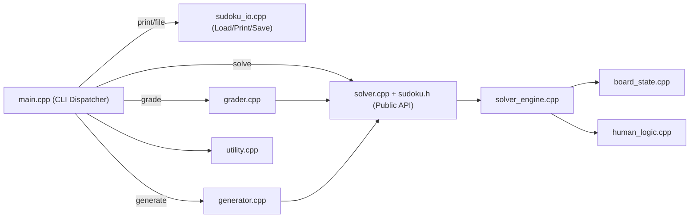
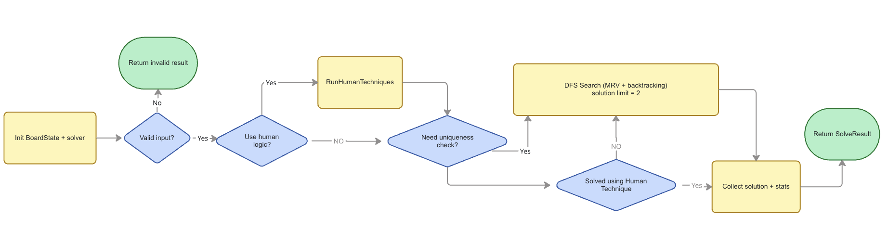
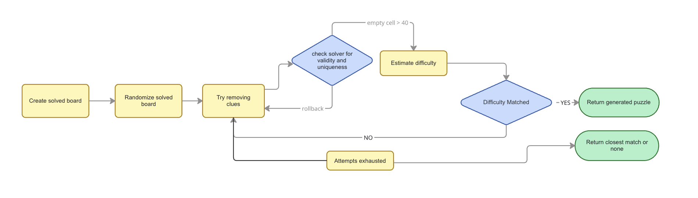

# Architecture



## Overview
This project is organized as a layered Sudoku system:
CLI handles commands, I/O handles files and rendering, public APIs expose stable operations, and the engine performs solving/generation logic.

## Layers
| Layer | Responsibility |
|---|---|
| CLI (`main.cpp`) | Parse commands and print results. |
| I/O (`sudoku_io.cpp`) | Load/save puzzles and format printable boards. |
| Public API (`sudoku.h`, `solver.cpp`) | Expose `solve`, `grade`, `generate` entry points. |
| Engine (`solver_engine.cpp`, `board_state.cpp`) | Run DFS, propagation, MRV, and uniqueness checks. |
| Domain modules (`human_logic.cpp`, `grader.cpp`, `generator.cpp`) | Human techniques, difficulty mapping, puzzle generation strategy. |
| Utility (`utility.cpp`) | Usage text, parsing helpers, report formatting, output paths. |

## High-Level Flow


## Project Tree (Key Parts)
```text
Sudoku_Solver/
├── include/
│   └── sudoku.h
├── src/
│   ├── main.cpp
│   ├── solver.cpp
│   ├── solver_engine.h
│   ├── solver_engine.cpp
│   ├── board_state.h
│   ├── board_state.cpp
│   ├── human_logic.h
│   ├── human_logic.cpp
│   ├── grader.cpp
│   ├── generator.cpp
│   ├── sudoku_io.cpp
│   ├── utility.h
│   └── utility.cpp
├── assignment_examples/
└── docs/
    ├── design.png
    ├── solver_engine.png
    ├── generation_logic.png
    └── ARCHITECTURE.md
```

## Core Types
| Type | Responsibility |
|---|---|
| `Board` | Canonical 9x9 Sudoku grid (`81` cells). |
| `BoardState` | Internal mutable state with row/column/box bitmasks and candidate operations. |
| `SolveResult` | Solve output: validity, solved flag, solution count, solution board, and metrics. |
| `GenerationResult` | Generator output: generated puzzle and detected difficulty. |
| `Difficulty` | Difficulty label: `easy`, `medium`, `hard`, `samurai`. |

## Command Flows
### `print`
1. CLI loads the file through I/O.
2. CLI prints `SudokuToPrettyString(board)`.

### `solve`
1. CLI loads the board.
2. Calls `SolveSudoku(..., requireUnique=true, useHumanTechniques=false)`.
3. Engine searches up to two solutions to verify uniqueness.
4. CLI prints metrics and the solved board.

### `grade`
1. CLI loads the board.
2. Calls `GradeSudoku(board, metrics)`.
3. Grader solves in grading mode and maps metrics to a difficulty.
4. CLI prints difficulty and metrics.

### `generate`
1. CLI parses difficulty and optional `--symmetry`.
2. `GenerateSudoku(...)` builds a solved board (`GenerateSolvedBoard(...)`).
3. Generator removes clues while preserving uniqueness.
4. Generator evaluates difficulty and keeps the closest match.
5. CLI saves and prints the generated puzzle.

## Solver Engine Design


This diagram shows the solver flow from input validation to search and final result construction.

Optimization techniques used in DFS:
1. Bitmask-based constraints for rows, columns, and boxes.
2. Naked-single propagation.
3. MRV (Minimum Remaining Values) branch selection.
4. Backtracking with solution counting for uniqueness checks.

## Generation Design


Generation strategy:
1. Start from a solved board.
2. Randomize using Sudoku-preserving permutations.
3. Remove clues while keeping exactly one solution.
4. Optionally enforce 180-degree rotational symmetry.
5. Return the closest difficulty match found within attempt limits.

## Difficulty Grading
Grading is heuristic and based on implemented logic plus search effort:
1. `easy`: naked singles only.
2. `medium`: hidden singles without pair techniques/backtracking.
3. `hard`: pair techniques or limited search effort.
4. `samurai`: heavier search effort.

## Assumptions and Scope
1. Scope is standard 9x9 Sudoku only.
2. Difficulty labels are implementation-based, not universal standards.
3. Symmetry mode supports only 180-degree rotational symmetry.
4. Generation is randomized, so outputs can vary between runs.
5. Difficulty grading does not require uniqueness verification.
6. For symmetry variants, see [SudokuWiki](https://www.sudokuwiki.org/Introduction).
